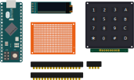
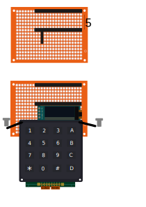

# keypad_midi
* Tutorial : https://create.arduino.cc/projecthub/labsud/midi-keypad-c68fd2
* Tutorial [FR] : https://wikifab.org/wiki/Pav%C3%A9_Num%C3%A9rique_MIDI
# Components required

# Soldering

